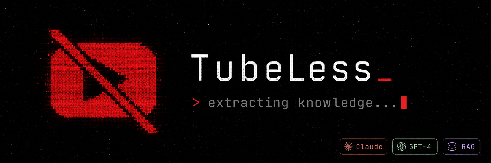

# TubeLess



> **Turn hours of YouTube content into structured knowledge and actionable insights — in minutes.**

A production-grade, **local-first** research and productivity platform that automates transcript extraction, multi-level AI summarization, cross-video knowledge synthesis, and RAG-powered conversational search — all running privately on your own machine via Docker.

---

## Why This Exists

Information density on YouTube is exploding. The best lectures, technical deep-dives, and expert debates are locked inside hours of video that no one has time to watch end-to-end.

This project solves that problem:

- **Accelerated learning** — Research any complex technical topic and get a consolidated synthesis of the best videos on the platform in minutes, not hours.
- **Surgical information retrieval** — Stop watching full videos just to find a 90-second segment. Extract exactly what you need, with timestamps.
- **Conversational RAG** — Ask cross-video questions like *"What are the tradeoffs between the approaches presented in videos X and Y?"* and get grounded, citation-backed answers.
- **Rich LLM context** — Use the synthesized transcripts as high-quality context for any LLM. Instead of asking a model to reason from its training data alone, feed it dense, topic-specific knowledge extracted directly from curated videos — ideal for research, writing, and deep dives into fast-moving subjects.
- **Verifiable sources** — Every chat response is anchored to the exact timestamp in the source video, making verification instant.
- **Total privacy** — All indexing, embedding generation, and vector storage run entirely in your local Docker environment. No data leaves your machine.

---

## 💡 The Power of Multi-Video Conversations: A Real-World Example

Usually, when researching a topic, you have to watch several videos, take notes, and try to manually connect the dots. With **TubeLess**, you can talk to all of them at once.

### 🇬🇧 Scenario: Finding the Best Method to Learn English
Imagine you want to find the most effective strategies for learning English. Instead of watching 5 different polyglots and teachers give 30-minute talks:

1. **Search** — Search for `"best method to learn English"` in TubeLess.
2. **Select** — Select the top 4 videos (e.g., a video on *comprehensible input*, one on *active recall*, one on *spaced repetition*, and another on *immersion*).
3. **Synthesize** — Let TubeLess extract the transcripts, generate individual summaries, and produce a **consolidated cross-video synthesis** automatically.
4. **Chat** — Ask comparative, deep questions across all 4 videos in the chat:
   - *"What is the difference between comprehensible input and active immersion as explained in these videos?"*
   - *"List all the practical steps recommended by the speakers to set up a 30-minute daily study routine."*

TubeLess will scan the transcripts of all selected videos, retrieve the relevant chunks using **Contextual Retrieval**, and generate a single unified answer, complete with **clickable timestamped citations** linking directly to the exact second in the video where each speaker mentioned it.

---

## Features

| Feature | Description |
|---|---|
| **YouTube Search** | Search and select multiple videos in a single query |
| **Transcript Extraction** | Smart cascading fallback — `youtube-transcript-api` → `yt-dlp` → Playwright |
| **AI Summarization** | Parallel Map-Reduce summarization pipeline that handles videos of any length |
| **Cross-Video Synthesis** | Consolidated knowledge synthesis comparing insights across multiple videos |
| **Contextual Retrieval** | Chunks enriched with video summary context before embedding, improving semantic quality |
| **Hybrid Search + Rerank** | Vector + full-text (RRF) search refined by a local cross-encoder (`flashrank`) |
| **Embedding Cache** | SHA-256 content-hash cache prevents re-generating embeddings for identical chunks |
| **RAG Chat** | Conversational interface with vector-based retrieval, reranking and precise source citations |
| **Structured Logging** | `structlog`-based observability with correlation IDs for pipeline tracing |
| **Local-First** | All heavy processing runs on your machine via Docker Compose |

---

## Architecture

```
search → video selection → transcript extraction → chunking (~1500 tokens)
  → map summarization of chunks (parallel) → reduce to per-video summary
  → cross-video synthesis
  → contextual retrieval enrichment → vectorization (embeddings, cached by hash)
  → hybrid search (vector + text via RRF) → cross-encoder reranking
  → interactive RAG chat
```

The pipeline is deliberately modular. Each stage is independently testable, and the LLM layer is fully swappable via a single environment variable.

### Retrieval Quality Stack

1. **Contextual Retrieval** — Each chunk is prefixed with video title, summary, and nearby key points before embedding, so isolated segments keep semantic coherence.
2. **Hybrid Search (RRF)** — Combines pgvector cosine similarity with PostgreSQL full-text search (`simple` dictionary), merged by Reciprocal Rank Fusion (k=60).
3. **Cross-Encoder Reranking** — A local `flashrank` model re-scores the top-k candidates using query–passage cross-attention (~15–30 ms), significantly improving precision over bi-encoder embeddings alone.
4. **Embedding Cache** — SHA-256 content-hash keyed by `(text, model)` prevents redundant API calls when reprocessing projects with different LLM models.

### Tech Stack

**Backend**
- Python 3.11+, FastAPI, Pydantic v2
- SQLAlchemy 2.0, PostgreSQL + pgvector
- LiteLLM (OpenAI / Anthropic / Groq / Gemini / OpenRouter)

**Frontend**
- Next.js 14 (App Router), TypeScript
- TailwindCSS, shadcn/ui

**Infrastructure**
- Docker Compose (local deployment)
- Alembic (database migrations)

---

## Getting Started

### Prerequisites

- Docker and Docker Compose
- An API key from any supported LLM provider (OpenAI, Anthropic, Groq, etc.)

### Setup

```bash
# 1. Clone and enter the project
cd youtube_fetch_compare

# 2. Create your environment file
cp .env.example .env

# 3. Edit .env with your API keys (see LLM Configuration below)

# 4. Start everything
docker compose up --build
```

The database and all tables are created automatically on first boot.

```bash
# Optional: run migrations for new updates
docker compose exec backend alembic upgrade head
```

**Access:**
- Frontend: http://localhost:3000
- Backend API: http://localhost:8000
- API Docs (Swagger): http://localhost:8000/docs

---

## LLM Configuration

The project uses [LiteLLM](https://docs.litellm.ai) as an abstraction layer, meaning you can swap providers by changing a single environment variable — no code changes required.

### Supported Providers

| Provider | `DEFAULT_MODEL` | API Key Variable |
|---|---|---|
| OpenAI | `gpt-4o-mini` | `OPENAI_API_KEY` |
| Anthropic | `anthropic/claude-3-5-sonnet-20241022` | `ANTHROPIC_API_KEY` |
| Groq | `groq/llama-3.3-70b-versatile` | `GROQ_API_KEY` |
| Gemini | `gemini/gemini-1.5-pro` | `GEMINI_API_KEY` |
| OpenRouter | `openrouter/anthropic/claude-3-5-sonnet` | `OPENROUTER_API_KEY` |

LiteLLM auto-detects the provider from the model prefix and loads the corresponding key from the environment.

### Embeddings

Embeddings default to `text-embedding-3-small` via OpenAI (`DEFAULT_EMBEDDING_MODEL`). You can mix providers freely — for example, use Groq for the LLM but keep OpenAI for embeddings (Groq does not offer an embeddings endpoint).

### Example Configurations

```bash
# OpenAI for everything
DEFAULT_MODEL=gpt-4o-mini
DEFAULT_EMBEDDING_MODEL=text-embedding-3-small
OPENAI_API_KEY=sk-...

# Groq for LLM + OpenAI for embeddings (cost-optimized)
DEFAULT_MODEL=groq/llama-3.3-70b-versatile
DEFAULT_EMBEDDING_MODEL=text-embedding-3-small
GROQ_API_KEY=gsk_...
OPENAI_API_KEY=sk-...

# Anthropic for LLM + OpenAI for embeddings
DEFAULT_MODEL=anthropic/claude-3-5-sonnet-20241022
DEFAULT_EMBEDDING_MODEL=text-embedding-3-small
ANTHROPIC_API_KEY=sk-ant-...
OPENAI_API_KEY=sk-...

# OpenRouter for everything (single key)
DEFAULT_MODEL=openrouter/anthropic/claude-3-5-sonnet
DEFAULT_EMBEDDING_MODEL=openrouter/openai/text-embedding-3-small
OPENROUTER_API_KEY=sk-or-...
```

---

## Environment Variables

| Variable | Description | Default |
|---|---|---|
| `POSTGRES_DB` | Database name | `tubeless` |
| `POSTGRES_USER` | Database user | `postgres` |
| `POSTGRES_PASSWORD` | Database password | `postgres` |
| `DEFAULT_MODEL` | LLM model identifier | `gpt-4o-mini` |
| `DEFAULT_EMBEDDING_MODEL` | Embedding model identifier | `text-embedding-3-small` |
| `OPENAI_API_KEY` | OpenAI API key | Provider-specific |
| `ANTHROPIC_API_KEY` | Anthropic API key | Provider-specific |
| `GROQ_API_KEY` | Groq API key | Provider-specific |
| `GEMINI_API_KEY` | Gemini API key | Provider-specific |
| `OPENROUTER_API_KEY` | OpenRouter API key | Provider-specific |
| `OPENAI_API_BASE` | Custom proxy base URL | Optional |
| `SECRET_KEY` | JWT secret key | **Change in production** |

---

## Usage

1. **Search** — Enter any topic on the homepage.
2. **Select** — Choose which videos to include from the results.
3. **Process** — The pipeline fetches transcripts, runs summarization, and builds the cross-video synthesis.
4. **Explore** — Browse the consolidated synthesis, individual summaries, and full transcripts.
5. **Chat** — Ask questions across all loaded videos. Get answers with timestamped citations.

---

## Project Structure

```
youtube_fetch_compare/
├── backend/                    # Python FastAPI application
│   ├── app/
│   │   ├── api/                # Route handlers and request/response schemas
│   │   ├── core/               # App config and database connection
│   │   ├── models/             # SQLAlchemy ORM models
│   │   ├── repositories/       # Data access layer (repository pattern)
│   │   └── services/           # Business logic and pipeline orchestration
│   └── alembic/                # Database migration scripts
├── frontend/                   # Next.js application
│   ├── src/
│   │   ├── app/                # Pages and layouts (App Router)
│   │   ├── components/         # Reusable React components
│   │   ├── hooks/              # Custom React hooks
│   │   ├── lib/                # Shared utilities and API client
│   │   └── stores/             # Global state (Zustand)
└── docker-compose.yml          # Local orchestration
```

---

## Local Development

### Quick start with `run-dev.ps1`

On Windows (PowerShell 7+), a single script starts everything:

```powershell
.\run-dev.ps1
```

It will:
1. Start a Postgres + pgvector Docker container (named `ytless-postgres`).
2. Run `poetry install` and apply Alembic migrations.
3. Seed test data if `backend/scripts/seed_test_data.py` exists.
4. Launch the backend (`uvicorn --reload`) and the frontend (`npm run dev`) in separate windows.

### Manual setup

#### Backend

```bash
cd backend
poetry install
alembic upgrade head
uvicorn app.main:app --reload
```

#### Frontend

```bash
cd frontend
npm install
npm run dev
```

---

## Design Decisions Worth Noting

**Map-Reduce summarization** handles videos of arbitrary length without hitting context window limits. Each transcript is split into ~1500-token chunks, summarized independently (map), then collapsed into a single coherent summary (reduce). This mirrors production patterns used in enterprise document processing pipelines.

**Repository pattern on the data layer** keeps the API handlers thin and the business logic independently testable, with a clean separation between persistence and domain logic.

**LiteLLM as an abstraction layer** means the entire LLM backend is configurable via environment variables. Swapping from OpenAI to Anthropic or a self-hosted Ollama instance requires zero code changes — a deliberate architectural decision for long-term maintainability.

**pgvector over external vector databases** keeps the stack minimal. For this use case, co-locating semantic search with the relational data in Postgres eliminates a network hop and reduces operational complexity without sacrificing retrieval quality.

---

## License

MIT